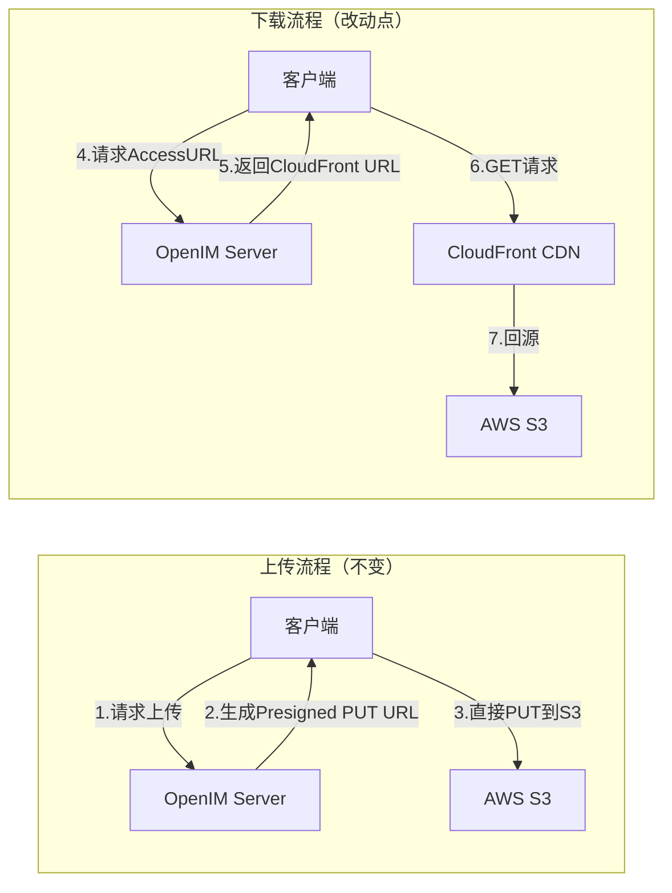

# OpenIM Server 方案B：AWS S3 + CloudFront 集成

## 背景上下文

### 问题

当前 open-im-server（v3.8.3-patch.12）的 AWS S3 驱动（来自 `openimsdk/tools` 依赖库）存在以下限制：

1. **不支持自定义 Endpoint / CloudFront** — `aws.Config` 结构体没有 CloudFront 相关字段

2. **`Aws.Build()` 忽略了 `Endpoint` 字段** — 虽然 `config.go` 的 `Aws` 结构体定义了 `Endpoint`，但 `Build()` 方法完全没有传递它

3. **AccessURL 生成的下载链接固定为 S3 域名** — 无法替换为 CloudFront CDN 域名

4. 如果客户端通过 CloudFront 域名发 PUT 请求，Host header 与 Presigned URL 签名不匹配，导致 **403 Forbidden**

### 方案选择

- **方案A**（直连 S3，零代码改动）— 适合简单场景，但无 CDN 加速

- **方案B**（S3 + CloudFront，本计划）— PUT 走 S3 直连，GET 走 CloudFront 公开分发

- **方案C**（MinIO 代理模式）— 折中方案

用户选择：**方案B + CloudFront 公开分发**

### 核心架构




## 目标版本

- **open-im-server**: `v3.8.3-patch.15`（从 GitHub Release 下载新代码）

- **openimsdk/tools**: 以 v3.8.3-patch.15 的 `go.mod` 中指定的版本为准（当前 patch.12 用的是 `v0.0.50-alpha.106`，新版可能有更新）

## 实施步骤

### Phase 1：环境准备

1. 从 GitHub 下载 `v3.8.3-patch.15` 源码：
   ```javascript
      https://github.com/openimsdk/open-im-server/archive/refs/tags/v3.8.3-patch.15.tar.gz
   ```


2. 确认 `go.mod` 中 `openimsdk/tools` 的版本号

3. 从 GitHub 克隆 `openimsdk/tools` 并 checkout 到对应版本 tag：
   ```bash
      git clone https://github.com/openimsdk/tools.git openimsdk-tools
      cd openimsdk-tools && git checkout <version-from-go.mod>
   ```


### Phase 2：修改 `openimsdk/tools`（AWS 驱动层）

目标文件：`openimsdk-tools/s3/aws/aws.go`

需要做 3 处改动：

- **改动 2a**：`Config` 结构体增加 `CloudFrontURL string` 字段

- **改动 2b**：`Aws` 结构体增加 `cloudFrontURL string` 字段，`NewAws()` 函数中赋值

- **改动 2c**：`AccessURL()` 方法中，如果 `cloudFrontURL` 非空，将生成的 S3 Presigned URL 的 scheme+host 替换为 CloudFront 域名，并去掉 S3 签名查询参数（公开分发不需要签名）

伪代码：

```go
func (a *Aws) AccessURL(ctx context.Context, name string, expire time.Duration, opt *s3.AccessURLOption) (string, error) {
    // ... existing presigned URL generation ...
    if a.cloudFrontURL != "" {
        u, _ := url.Parse(rawURL)
        cf, _ := url.Parse(a.cloudFrontURL)
        u.Scheme = cf.Scheme
        u.Host = cf.Host
        u.RawQuery = ""  // 公开分发不需要 S3 签名参数
        return u.String(), nil
    }
    return rawURL, nil
}
```


### Phase 3：修改 `open-im-server`（配置层）

**文件 A**：`pkg/common/config/config.go`

- `Aws` 结构体增加 `CloudFrontURL string \`mapstructure:"cloudFrontURL"\`` 字段
- `Build()` 方法增加 `CloudFrontURL: o.CloudFrontURL` 传递

**文件 B**：`config/openim-rpc-third.yml`

- `aws` 配置块增加 `cloudFrontURL` 字段

### Phase 4：连接两个仓库

在 `open-im-server` 的 `go.mod` 末尾添加 replace 指令，指向本地 tools 目录：

```javascript
replace github.com/openimsdk/tools => ../openimsdk-tools
```


运行 `go mod tidy` 确保依赖一致。

### Phase 5：编译验证

```bash
go install github.com/magefile/mage@v1.15.0
go mod tidy
mage build
```


确认 `_output/` 目录下生成了 `openim-rpc-third` 等二进制文件。

### Phase 6：构建 Docker 镜像

两种方式（二选一）：

**方式一（推荐）：go mod vendor**

```bash
go mod vendor    # 将所有依赖（含修改后的 tools）复制到 vendor/
docker build -t openim-server:v3.8.3-patch.15-cf .
```

**方式二：调整 Docker build context**

- 将 `openimsdk-tools/` 和 `open-im-server/` 放在同一父目录

- 修改 Dockerfile 在 builder 阶段 COPY tools 代码

- `go.mod` 中 replace 路径改为 Docker 内路径

### Phase 7：部署配置

修改 `config/openim-rpc-third.yml`：

```yaml
object:
  enable: aws
  aws:
    region: ap-southeast-2
    bucket: <your-bucket>
    accessKeyID: <your-key>
    secretAccessKey: <your-secret>
    sessionToken:
    cloudFrontURL: https://dXXXXXXX.cloudfront.net
```

AWS 端需要配置：

- S3 Bucket CORS 策略（允许 PUT/GET）

- IAM 用户权限（s3:PutObject, s3:GetObject, s3:DeleteObject 等）

- CloudFront Distribution（Origin 指向 S3，使用 OAC，公开分发）
- S3 Bucket Policy（允许 CloudFront 通过 OAC 读取）

## 改动量汇总

| 文件 | 改动 | 行数 |

|------|------|------|

| `openimsdk-tools/s3/aws/aws.go` | Config + Aws 结构体 + NewAws + AccessURL | ~25行 |

| `open-im-server/pkg/common/config/config.go` | Aws 结构体 + Build() | ~3行 |

| `open-im-server/config/openim-rpc-third.yml` | 增加 cloudFrontURL | ~1行 |

| `open-im-server/go.mod` | replace 指令 | ~1行 |

| **合计** | | **~30行** |

## 注意事项

- **新版差异**：v3.8.3-patch.15 相比 patch.12 有若干 bugfix 和重构，但 S3/third 相关代码大概率无变化（changelog 中无 S3 相关改动）。进入新会话后需先确认 `pkg/common/config/config.go` 和 `internal/rpc/third/third.go` 的结构是否一致

- **tools 版本**：新版 go.mod 中的 `openimsdk/tools` 版本可能升级，需要 checkout 到对应版本后再改